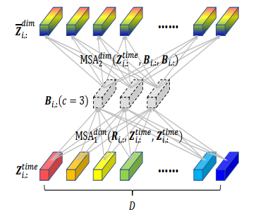

This is the code for the paper "Cross-GCN: Traffic flow prediction based on interdimensional attention space-time model"

# Visusalization
to visualize the lstm-attention model, we can use the "visualization.ipynb"

the spatial attention weights are sparse as follows:    


this is our motivation to propose the router on spatial

the router-attention as follows:

<div align=center><div/>
# Usage
+ prepare data

the PEMSD4、PEMSD7、PEMSD8、METR-LA data can be downloaded from this [google drive link](https://drive.google.com/drive/folders/13teLsvLL5M-0h36Xzjk24n1MHhQSmbCc?usp=drive_link)

to prepare the data, you can run the following command:

```
python prepare_Data.py 
```
+ train the model

to train the model, you can simply  run the following command:

```
python train_Crossgcn.py
```

+ grid search

to search the best hyperparameters, you can run the following command:

```
python grid_search.py
```


# Custom data

We also support the custom data

if your data is in the format like PEMS, you can simply run the following command:

```
python prepare_Data.py --data_path your_data_path
```

if your data is 2D, you can run the following command:

```
python dataset/prepare_Data_2D.py --data_path your_data_path
```
and then you can train the model as usual
