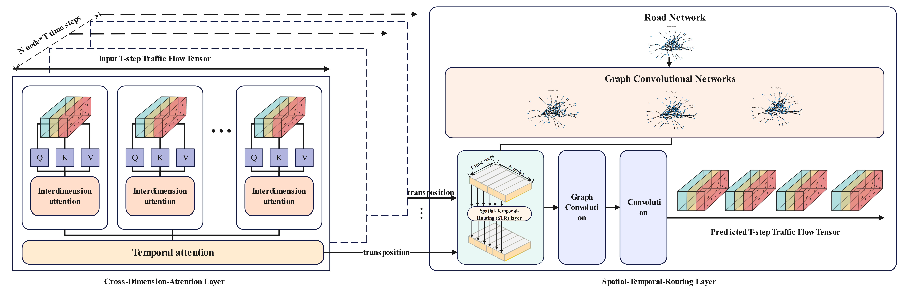
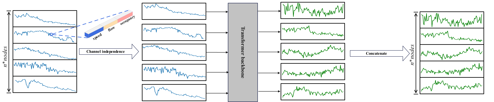

This is the code for the paper "Traffic speed prediction,Routing mechanism,Spatial-temporal graph data,Graph convolution" 

**Authors**: Guangyu Wang\#,Junshuo Zhang\#, Ming Gao\#*, Zhiqiao Wu\#, Bowei Chen\#，Jiafu Tang\#. Dongbei University of Finance and Economics, all the authors contributed equally to this work. Corresponding author: Ming Gao.

> \*Corresponding Author .\# Equal Contributions

[](https://colab.research.google.com/drive/1OApodP_B0BHf3_8mFl369YK-VsGGjDut#scrollTo=avX9rvt3DCee)


# 💡 Highlights

+ Introducing an transformer-based spatio-temporal model framework, incorporating previous research into our framework.



+ We designed a CDA consisting of two modules to enhance the predictive performance of multi-dimensional information, and developed an efficient spatio-temporal routing mechanism for information transmission through a unified spatio-temporal router.



+  Explicitly considering the sparsity of spatial attention and dependencies between multi-dimensional traffic data compared to existing methods (perhaps the first to our best knowledge), further enhancing the model's predictive performance.

+  Experimental results on two real-world traffic flow datasets demonstrate that our STDGNN outperforms 10 baselines in terms of effectiveness.
  \end{enumerate}

  

# 🔧 Usage

+ prepare data

the PEMSD4、PEMSD7、PEMSD8、METR-LA data can be downloaded from this [google drive link](https://drive.google.com/drive/folders/13teLsvLL5M-0h36Xzjk24n1MHhQSmbCc?usp=drive_link)

to prepare the data, you can run the following command:

```
python prepare_Data.py 
```

+ train the model

to train the model, you can simply  run the following command:

```
python train_Crossgcn.py
```

+ grid search

to search the best hyperparameters, you can run the following command:

```
python grid_search.py
```

# 🔧Custom data

We also support the custom data

if your data is in the format like PEMS, you can simply run the following command:

```
python prepare_Data.py --data_path your_data_path
```

if your data is 2D, you can run the following command:

```
python dataset/prepare_Data_2D.py --data_path your_data_path
```

and then you can train the model as usual

